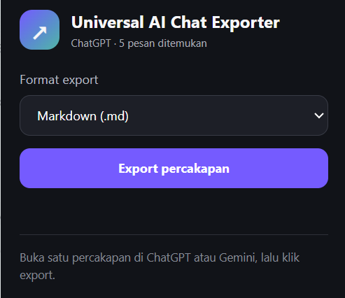

# Universal AI Chat Exporter

**Export, archive, and safely continue your AI conversations anywhere.**

[](./manifest.json)
[](./manifest.json)
[](./LICENSE)
[](./PRIVACY.md)


Universal AI Chat Exporter is a free, open-source browser extension that saves the conversation currently open in ChatGPT, Gemini, or Claude. It can export a chat as Markdown, standalone HTML, structured JSON, or plain text without requiring a backend or another account.

The project is growing from a simple exporter into a portable, privacy-conscious conversation layer. The long-term goal is to let people keep their AI work, search their own archive, and safely continue a conversation in another AI without silently sending anything.

> Current release: export, preview, select, import, and copy portable AI context locally. A persistent archive and direct cross-AI continuation are planned and are not available yet.

## Why this project exists

AI conversations often contain useful work: decisions, research notes, code, explanations, and project history. That work is usually locked inside one provider's interface and may be difficult to save in a reusable format.

Universal AI Chat Exporter is being built around three principles:

1. **Portable** — conversations should be readable outside the original AI website.
2. **Private by default** — exporting should not require uploading chat content to another server.
3. **User controlled** — the extension should never silently send a conversation to another AI.

## Current capabilities

- Export the conversation currently open in ChatGPT, Gemini, or Claude.
- Extract full conversation history without scrolling when the provider response is available.
- Fall back to the visible page when a provider's internal response is unavailable or changes.
- Preserve the active branch of branched ChatGPT and Claude conversations.
- Export to Markdown, standalone HTML, JSON, or plain text.
- Preview messages and choose exactly which ones to include.
- Estimate context size and approximate token usage before export or handoff.
- Copy selected messages in a boundary-marked **Copy for AI** format.
- Import and validate versioned conversation capsules, including legacy JSON exports.
- Generate safe filenames across operating systems.
- Process exports locally with no project backend, analytics, or telemetry.

## Preview



The popup detects the supported AI in the active tab, reports how many messages were found, and lets the user choose an export format.

## Supported providers

| Provider | Extraction strategy | DOM fallback | Status |
| --- | --- | --- | --- |
| ChatGPT | Authenticated conversation response and active-branch traversal | Yes | Supported |
| Gemini | Captured conversation RPC decoded as the page loads | Yes | Supported |
| Claude | Authenticated conversation response and active-branch traversal | Yes | Supported |

Provider websites and their internal response formats can change without notice. The DOM fallback keeps basic export available, but a provider update may temporarily reduce extraction quality.

## How extraction works

```text
Supported AI tab
      |
      v
Provider adapter
      |
      +-- structured conversation response available?
      |          |
      |          +-- yes --> normalize full active conversation
      |          |
      |          +-- no  --> extract messages currently available in the DOM
      |
      v
Shared conversation model
      |
      v
Markdown / HTML / JSON / text serializer
      |
      v
Browser download prompt
```

### ChatGPT

The adapter reads the conversation ID from `/c/{conversation-id}` and requests the conversation response using the user's existing browser session. ChatGPT represents a conversation as a graph because responses can be regenerated or branched. The exporter walks backward from `current_node`, reverses the result, and exports only the branch currently selected by the user.

If the structured request fails, the adapter extracts the rendered conversation turns from the page.

### Gemini

Gemini loads conversation history through a batched RPC response. A small script running in the page context observes the `hNvQHb` conversation response, decodes only the user and assistant messages, and passes the normalized result to the isolated extension context.

The capture starts at `document_start`, so the Gemini page must be refreshed after installing or reloading the extension. If no valid captured response is available for the current `/app/{conversation-id}`, the adapter uses the rendered Gemini message elements.

### Claude

The adapter discovers the organization-scoped conversation URL from resources already used by the page, then requests that response using the user's existing session. Claude also supports conversation branches, so the exporter follows `current_leaf_message_uuid` through each parent message.

If the response cannot be used, the adapter falls back to Claude's rendered user and assistant messages.

## Architecture

```text
┌──────────────────────────────── Browser extension (MV3) ────────────────────────────────┐
│                                                                                          │
│  AI website                         Isolated content scripts                             │
│  ┌──────────────────────┐           ┌────────────────────────────────────────────────┐   │
│  │ ChatGPT / Claude API │──────────▶│ Provider adapters                              │   │
│  │ responses            │           │  - match the current provider                  │   │
│  └──────────────────────┘           │  - prefer structured full-history extraction   │   │
│                                     │  - normalize roles and message text             │   │
│  ┌──────────────────────┐  bridge   │  - fall back to DOM extraction                  │   │
│  │ Gemini page-world    │──────────▶│                                                │   │
│  │ response capture     │           └───────────────────────┬────────────────────────┘   │
│  └──────────────────────┘                                   │                            │
│                                                             v                            │
│  ┌──────────────────────┐           ┌────────────────────────────────────────────────┐   │
│  │ Popup UI             │──────────▶│ Shared core                                    │   │
│  │ preview + selection  │           │  - normalize and validate conversations        │   │
│  │ import + Copy for AI │           │  - capsule, context, and export serializers     │   │
│  └──────────────────────┘           └───────────────────────┬────────────────────────┘   │
│                                                             │                            │
│                                                             v                            │
│                                     ┌────────────────────────────────────────────────┐   │
│                                     │ Background service worker                      │   │
│                                     │ browser-managed local download                 │   │
│                                     └────────────────────────────────────────────────┘   │
└──────────────────────────────────────────────────────────────────────────────────────────┘
```

### Trust boundaries

- Provider requests use the session that already exists inside the user's browser.
- The extension does not copy, store, or export cookies and authentication headers.
- Chat content is normalized in memory and reaches the download system or clipboard only after the matching user action.
- The Gemini page-world bridge accepts conversation data only for the current Gemini origin and conversation path.
- There is no application server between the AI page and the exported file.

## Project structure

```text
universal-ai-chat-exporter/
├── manifest.json
├── background.js                    # Validates export payloads and starts downloads
├── content/
│   ├── core.js                      # Shared text cleanup, normalization, and serializers
│   ├── main.js                      # Popup-to-page message handling and export workflow
│   ├── gemini-page-capture.js       # MAIN-world Gemini RPC response observer
│   ├── gemini-capture-bridge.js     # Isolated-world validation and in-memory capture
│   └── adapters/
│       ├── chatgpt.js               # ChatGPT graph/API extraction + DOM fallback
│       ├── gemini.js                # Captured Gemini history + DOM fallback
│       └── claude.js                # Claude graph/API extraction + DOM fallback
├── popup/
│   ├── popup.html                   # Extension popup markup
│   ├── popup.css                    # Popup presentation
│   └── popup.js                     # Preview, selection, import, copy, and export actions
├── PRIVACY.md
├── CONTRIBUTING.md
└── README.md
```

## Shared conversation model

Every provider adapter returns the same minimal internal shape:

```json
{
  "provider": "ChatGPT",
  "title": "Example conversation",
  "url": "https://chatgpt.com/c/...",
  "messages": [
    {
      "role": "user",
      "content": "How should this feature work?"
    },
    {
      "role": "assistant",
      "content": "Start with a small, testable workflow."
    }
  ]
}
```

Keeping provider extraction separate from serialization makes it easier to add providers and output formats without duplicating the whole export pipeline.

## Portable capsule schema

JSON exports wrap the normalized conversation in a versioned envelope. Import validates the schema and version before any content is shown or re-exported.

```json
{
  "schema": "universal-ai-chat/conversation",
  "version": 1,
  "exportedAt": "2026-09-01T00:00:00.000Z",
  "conversation": {
    "provider": "ChatGPT",
    "title": "Example conversation",
    "url": "https://chatgpt.com/c/...",
    "messages": [
      {
        "role": "user",
        "content": "How should this feature work?"
      }
    ]
  }
}
```

Version 1 accepts only `user` and `assistant` message roles with string content. The importer also migrates the unversioned JSON shape produced by releases before 0.3.0.

## Export formats

| Format | Best for |
| --- | --- |
| Markdown | Obsidian, notes, documentation, and version control |
| HTML | A readable, standalone offline copy |
| JSON | Versioned portable capsules, imports, and integrations |
| Plain text | Simple, portable backups and manual AI handoff |

## Installation

### From a GitHub release

1. Download the ZIP from the [latest release](https://github.com/Agelakz/universal-ai-chat-exporter/releases/latest).
2. Extract the ZIP.
3. Open `chrome://extensions` in Chrome or `edge://extensions` in Edge.
4. Enable **Developer mode**.
5. Choose **Load unpacked**.
6. Select the extracted directory that directly contains `manifest.json`.
7. Refresh any ChatGPT, Gemini, or Claude tabs that were already open.

> The extension is not yet published on the Chrome Web Store or Microsoft Edge Add-ons.

### From source

```bash
git clone https://github.com/Agelakz/universal-ai-chat-exporter.git
cd universal-ai-chat-exporter
```

Load the repository directory as an unpacked extension. There is no build step and no runtime dependency installation.

## Usage

1. Open a saved conversation in ChatGPT, Gemini, or Claude.
2. Click the extension icon.
3. Confirm that the provider and message count are detected.
4. Preview the conversation and optionally deselect messages.
5. Review the approximate token and file-size estimate.
6. Choose **Copy for AI**, or select Markdown, HTML, JSON, or plain text and click **Export pilihan**.
7. A JSON capsule can also be imported locally from any tab.

For Gemini, refresh the page once after the extension is installed, updated, or reloaded. You should not need to scroll through the conversation before exporting when structured extraction succeeds.

## Privacy

- Conversation content is processed locally in the browser.
- The project has no backend, analytics, or telemetry.
- It does not collect passwords, cookies, or authentication tokens.
- It does not automatically archive every conversation.
- It does not send exported content to another AI provider.
- A file is generated only after the user explicitly starts an export.

See [PRIVACY.md](./PRIVACY.md) for the complete privacy statement.

## Permissions

| Permission | Purpose |
| --- | --- |
| `activeTab` | Communicate with the supported tab selected by the user |
| `downloads` | Save the generated export through the browser download system |
| `storage` | Remember the selected export format locally |
| `https://chatgpt.com/*` | Run the ChatGPT adapter |
| `https://chat.openai.com/*` | Support the legacy ChatGPT domain |
| `https://gemini.google.com/*` | Run Gemini capture and extraction |
| `https://claude.ai/*` | Run the Claude adapter |

The extension does not request `<all_urls>` access.

## Product roadmap

The roadmap moves from reliable export toward a user-controlled conversation portability layer.

### Phase 1 — Reliable export

- [x] ChatGPT, Gemini, and Claude adapters
- [x] Markdown, HTML, JSON, and plain-text output
- [x] Full-history extraction without scrolling when structured responses are available
- [x] Active-branch extraction for ChatGPT and Claude
- [x] DOM fallback for provider changes and unsupported conversation states
- [ ] Browser-level end-to-end regression fixtures for long conversations
- [ ] Improved code block, citation, attachment, and artifact preservation

### Phase 2 — Portable context

- [x] Versioned Universal AI Conversation JSON schema
- [x] **Copy for AI** format that clearly separates transcript from new instructions
- [x] Token and size estimate before copying or continuing a conversation
- [x] Preview and selection of messages included in a handoff
- [x] Import and validate a previously exported conversation capsule

### Phase 3 — Safely continue anywhere

- [ ] **Continue in ChatGPT / Claude / Gemini** actions
- [ ] Open the destination provider and fill its composer with a reviewable draft
- [ ] Never auto-submit by default
- [ ] One-time, expiring handoff state that is deleted immediately after use
- [ ] Clear warning when content is about to cross provider boundaries

### Phase 4 — Local archive

- [ ] Explicit **Save to archive** action
- [ ] Local conversation library with provider, date, and title filters
- [ ] Full-text search across user-owned exports
- [ ] Import, export, rename, and delete controls
- [ ] Storage usage and retention controls
- [ ] No silent background recording

### Phase 5 — Broader support

- [ ] DeepSeek adapter
- [ ] Additional providers through the same adapter interface
- [ ] Firefox compatibility review
- [ ] Optional context compression with an explicit privacy disclosure

## Non-goals

To keep the project understandable and trustworthy, the following are not current goals:

- Syncing provider accounts, hidden prompts, or internal model state.
- Bypassing authentication, subscriptions, rate limits, or provider access controls.
- Silently monitoring and storing every AI conversation.
- Automatically sending private chat content to another provider.
- Claiming that an AI-generated summary is lossless.

## Known limitations

- Only the conversation currently open in the active tab can be exported.
- Provider internal APIs and RPC schemas are undocumented and may change.
- The DOM fallback can only export messages currently rendered by the page.
- Binary attachments are not downloaded.
- Some citations, canvases, artifacts, tool calls, and interactive content use a text fallback.
- Gemini must load the conversation after the capture scripts are active.
- Full-history behavior has parser-level coverage but still benefits from browser-level testing across different account and conversation types.

## Development

The project uses plain JavaScript and Chrome Extension Manifest V3. It intentionally has no framework, bundler, backend, or required build step.

After editing a content script:

1. Reload the extension from the browser's extensions page.
2. Refresh the provider tab.
3. Test both structured extraction and DOM fallback where possible.
4. Export JSON first to verify message order and count.
5. Confirm that no HAR, cookie, token, or private conversation fixture is staged in Git.

HAR files are ignored by the repository because they frequently contain active session credentials and private chat content.

## Contributing

Issues and pull requests are welcome. For extraction bugs, include the provider, browser version, extension version, expected message count, actual message count, and sanitized reproduction steps.

Never attach an unsanitized HAR, cookie, token, account identifier, or private conversation to a public issue. Read [CONTRIBUTING.md](./CONTRIBUTING.md) before submitting a pull request.

## Acknowledgements

The local development baseline used the MIT-licensed ChatGPT Exporter by pionxzh as an upstream research reference. Universal AI Chat Exporter uses a separate, minimal implementation; the reference source is not included in repository commits or release packages.

## License

Released under the [MIT License](./LICENSE).
